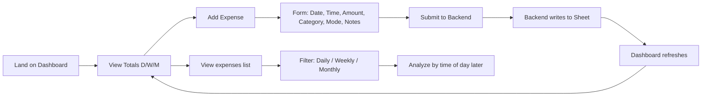
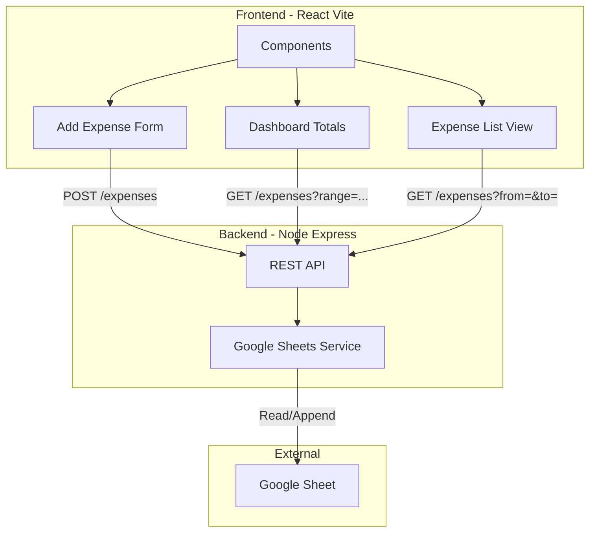

# Expense Tracker Web App – Execution Plan

---

## Step 1: Finalized MVP Scope & System Design

### 1.1 Product Plan

**MVP feature list (must-have only)**


| #   | Feature                    | Description                                                          | Success criterion                                          |
| --- | -------------------------- | -------------------------------------------------------------------- | ---------------------------------------------------------- |
| 1   | Add expense                | Manual entry form: Date, Time, Amount, Category, Payment Mode, Notes | Entry in &lt;10 seconds; data written to Sheet             |
| 2   | View expenses              | List/filter by Daily, Weekly, Monthly range                          | Correct date-range filtering; readable on mobile + desktop |
| 3   | Time-of-day tagging        | Store hour (or time); support hour-based analysis                    | Hour captured on add; usable for later analysis            |
| 4   | Dashboard totals           | Display Daily total, Weekly total, Monthly total                     | Correct aggregates; updates after add                      |
| 5   | Google Sheets integration  | Read/write via backend; Sheet = source of truth                      | No data loss; consistent schema                            |
| 6   | Responsive layout          | Mobile-first; works on phone and laptop                              | Usable on 320px and 1280px+                                |
| 7   | Clean UI, no ads, no login | Single-user local/session; no auth for MVP                           | No login gate; no third-party ads                          |


**Feature-to-competitor differentiation**


| Our feature                     | Competitor gap                                                                                                                     |
| ------------------------------- | ---------------------------------------------------------------------------------------------------------------------------------- |
| Google Sheets as DB             | Expensify uses Zapier/export only; no competitor uses native Sheets as primary store                                               |
| Time-of-day analysis            | No competitor offers hour-based spending patterns (report finding)                                                                 |
| No login for MVP                | Reduces friction vs YNAB/Mint/PocketGuard account creation                                                                         |
| Fast manual entry, no bank sync | Addresses “syncing delays” and “privacy” concerns; aligns with Money Manager / Spending Tracker strength without their limitations |
| No ads                          | Differentiates from Mint, Walnut, Money Manager free tiers                                                                         |


**User flow**




- **Add expense:** Dashboard → “Add expense” → fill form → submit → backend appends row to Sheet → redirect/refresh → updated totals.
- **View:** Dashboard shows D/W/M totals; “View expenses” shows list with date-range selector (Daily / Weekly / Monthly).
- **Analyze:** Same list + filters; time-of-day analysis uses stored Time/hour (Should Have: charts; MVP can show table/breakdown by hour).

---

### 1.2 System design (high-level)




- **Frontend:** React + Vite; mobile-first; calls backend REST API only (no direct Sheets from browser for credentials safety).
- **Backend:** Node + Express; exposes REST endpoints; single “Google Sheets service” layer for read/append; env-based config (Sheet ID, credentials).
- **Storage:** One Google Sheet; one “Expenses” sheet (tab); schema: Date, Time, Amount, Category, Payment Mode, Notes, Created Timestamp.

---

## 2. Technical Architecture

### 2.1 Folder structure

**Repo root (monorepo or separate repos; single repo suggested for MVP)**

```
expense-tracker/
├── client/                 # React + Vite frontend
│   ├── src/
│   │   ├── components/      # Reusable (Button, Input, Card, etc.)
│   │   ├── views/          # Dashboard, AddExpense, ExpenseList
│   │   ├── hooks/          # useExpenses, useTotals (if needed)
│   │   ├── api/            # fetch wrappers for backend
│   │   ├── App.jsx
│   │   └── main.jsx
│   ├── index.html
│   ├── vite.config.js
│   └── package.json
├── server/                 # Node + Express backend
│   ├── src/
│   │   ├── routes/         # expenseRoutes.js
│   │   ├── services/       # sheetsService.js
│   │   ├── config/         # env, constants
│   │   ├── middleware/     # error handler, CORS (if needed)
│   │   └── app.js
│   ├── package.json
│   └── (optional) server.js → app
└── README.md
```

**Alternative:** `frontend/` and `backend/` instead of `client/` and `server/` — pick one and stick.

### 2.2 API design

**Base URL:** `http://localhost:3001/api` (or env `API_BASE`).


| Method | Endpoint           | Purpose              | Request                                                      | Response                                                                       |
| ------ | ------------------ | -------------------- | ------------------------------------------------------------ | ------------------------------------------------------------------------------ |
| POST   | `/expenses`        | Add one expense      | Body: `{ date, time, amount, category, paymentMode, notes }` | `201` + `{ id?, date, time, amount, category, paymentMode, notes, createdAt }` |
| GET    | `/expenses`        | List/filter expenses | Query: `from`, `to` (ISO date), optional `range=day          | week                                                                           |
| GET    | `/expenses/totals` | Dashboard aggregates | Query: `period=day                                           | week                                                                           |


**Request/response examples**

- **POST /expenses**  
Request: `{ "date": "2026-02-08", "time": "14:30", "amount": 500, "category": "Food", "paymentMode": "UPI", "notes": "Lunch" }`  
Response: `201` + same object with `createdAt` (and optional `id` if you add row index/id).
- **GET /expenses?from=2026-02-01&to=2026-02-08**  
Response: `{ "expenses": [ { date, time, amount, category, paymentMode, notes, createdAt }, ... ] }`.
- **GET /expenses/totals?date=2026-02-08**  
Response: `{ "daily": 1200, "weekly": 8400, "monthly": 32000 }` (backend computes from Sheet data).

**Schema alignment:** Backend maps API fields to Sheet columns: Date, Time, Amount, Category, Payment Mode, Notes, Created Timestamp.

### 2.3 Google Sheets integration flow

1. **Setup:** Google Cloud project → enable Sheets API → create Service Account → share target Sheet with service account email (Editor) → store key JSON in `server` (or env for key path).
2. **Backend:** Use `googleapis` (or similar) with service account credentials; `sheetsService.js` implements:
  - **Append:** `spreadsheets.values.append` to add one row (Date, Time, Amount, Category, Payment Mode, Notes, Created Timestamp).
  - **Read:** `spreadsheets.values.get` for range (e.g. `Expenses!A2:G1000`); parse into array of expense objects.
3. **No auth for MVP:** Backend holds credentials; frontend never sees Sheet ID or credentials. Optional: simple env-based “allow list” for origins (CORS).

### 2.4 Error-handling strategy

- **Backend:** Central error middleware; catch async errors; return JSON `{ error: message, code? }` and appropriate status (400 validation, 502 Sheets failure, 500 generic).
- **Sheets:** On append/read failure, log and return 502 with generic message (“Storage temporarily unavailable”); never expose Sheet structure or credentials.
- **Frontend:** API client checks `response.ok`; on failure show short toast or inline message; retry not required for MVP.
- **Validation:** Backend validates required fields and types (date, time, amount number, non-empty category/paymentMode); return 400 with field-level errors if needed.

---

## 3. Development Roadmap

**Phase 1 – Setup**  

- **Goal:** Repo, tooling, and Sheet ready.  
- **Tasks:** Create repo; init `client` (Vite + React) and `server` (Node + Express); add `.env.example` for Sheet ID and credentials path; create Google Sheet and set schema (header row); share with service account; add README with setup steps.  
- **Output:** `npm run dev` (client) and `npm run dev` (server) run; Sheet has header row only.

**Phase 2 – Backend**  

- **Goal:** REST API and Sheets read/write working.  
- **Tasks:** Implement `sheetsService` (append, read range); implement `POST /expenses` and `GET /expenses` (with from/to); implement `GET /expenses/totals` (compute daily/weekly/monthly from read data); add validation and error middleware; test with Postman/curl.  
- **Output:** Can add and list expenses and get totals via API; data persists in Sheet.

**Phase 3 – Frontend (core)**  

- **Goal:** Add expense and view list + dashboard.  
- **Tasks:** API client helpers (`api/`); Add Expense form (date, time, amount, category, payment mode, notes); Dashboard view (daily/weekly/monthly totals); Expense list view with date-range (daily/weekly/monthly); routing (e.g. React Router): `/`, `/add`, `/expenses`; responsive layout (mobile-first).  
- **Output:** User can add expense and see totals and list by range.

**Phase 4 – Integration & time-of-day**  

- **Goal:** End-to-end flow and time-of-day support.  
- **Tasks:** Connect form submit to `POST /expenses` and refresh dashboard/list; ensure Time column used for time-of-day (store hour or full time); add simple “by time of day” view or section (e.g. table grouped by hour); fix CORS and env for local dev.  
- **Output:** Full flow working; time-of-day data captured and displayable.

**Phase 5 – Polish**  

- **Goal:** Portfolio-ready and NFRs.  
- **Tasks:** Loading and error states; basic accessibility (labels, focus); README (run instructions, env, Sheet setup); light performance pass (e.g. avoid over-fetch); code cleanup and small refactors.  
- **Output:** Clean, presentable codebase; fast load; simple UX; easy to extend (charts, OCR, auth later).

---

## 4. Expected Final Output (End state)

- **Working web app** (mobile + desktop): Add expense, view by daily/weekly/monthly, dashboard with D/W/M totals, time-of-day analysis (at least data + simple view).
- **Expense form → Google Sheet:** Every submit appends a row; Sheet is source of truth.
- **Dashboard:** Daily total, Weekly total, Monthly total (and list view with range selector).
- **Time-of-day:** Hour (or time) stored and usable for analysis (table or breakdown).
- **Codebase:** Clear structure (components, routes, services, API); README; env-based config; suitable for portfolio.

---

## 5. Non-functional requirements

- **Fast load:** Minimal JS; lazy-load non-critical views if needed; keep bundle small.
- **Simple UX:** Few clicks to add; clear labels; no unnecessary steps; no ads; no login for MVP.
- **Extensibility:** Chart views (Should Have) in own components; API designed for filters/search; Sheets service behind one module so OCR or auth can be added later without rewriting core.

---

## Next steps (after plan approval)

1. Create repo and folder structure (Phase 1).
2. Implement backend and Sheets service (Phase 2).
3. Build frontend and wire to API (Phases 3–4).
4. Polish and document (Phase 5).

No full code in this plan; each phase can be broken into smaller implementation tasks when you start coding.